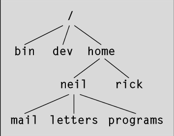
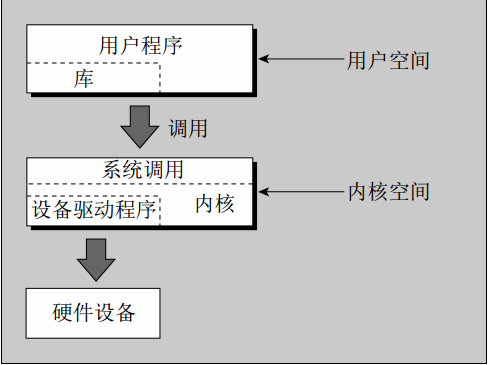

# 第三章 文件操作

---

## Linux文件结构

Linux环境中的文件具有特别重要的意义，因为它们为操作系统服务和设备提供了一个简单而一致的接口。在Linux中，**一切（或几乎一切）都是文件**。

这就意味着，通常程序完全可以像使用文件那样使用磁盘文件、串行口、打印机和其他设备。大多数情况下，你只需要使用5个基本的函数——open、close、read、write和ioctl。

目录是一种特殊类型的文件，在现代的UNIX（包括Linux）版本中，即使是超级用户可能也不再被允许直接对目录进行写操作了。所有用户通常使用上层的opendir/readdir接口来读取目录。

### 目录

文件，除了本身包含的内容以外，它还会有一个名字和一些属性。这些属性被保存在文件的inode（节点）中，它是文件系统中的一个特殊的数据块，它同时还包含文件的长度和文件在磁盘上的存放位置。系统使用的是文件的inode编号，目录结构为文件命名仅仅是为了便于人们使用。

目录是用于保存其他文件的节点号和名字的文件。目录文件中的每个数据项都是指向某个文件节点的链接，删除文件名就等于删除与之对应的链接（文件的节点号可以通过ls -i命令查看）。你可以通过使用ln命令在不同的目录中创建指向同一个文件的链接。

---

**【my note】**

假如有一个文件名为foo.txt，然后执行：

```
$ ln foo2.txt foo.txt ## 如此一来，foo2.txt和foo.txt将是同一个文件
$ ls -il foo*
```

可以看到，这两个文件的节点号是一致的，且链接数都是2。

---

删除一个文件时，实质上是删除了该文件对应的目录项，同时指向该文件的链接数减1。如果指向某个文件的链接数（即ls -l命令输出中跟在访问权限后面的那个数字）变为0，就表示该节点以及其指向的数据不再被使用，磁盘上的相应位置就会被标记为可用空间。

文件被安排在目录中，目录中可能还包含子目录。这就构成了文件系统层次结构。如图：



### 文件和设备

硬件设备在Linux中通常也被表示（映射）为文件。例如，作为超级用户，你可以使用如下命令将IDE CD-ROM驱动器挂载为一个文件：

```
# mount -t iso9660 /dev/hdc /mnt/cdrom
# cd /mnt/cdrom
```

这个命令将CD-ROM设备中的当前内容挂载为/mnt/cdrom目录下的文件结构。然后，你就可以像往常一样浏览CD-ROM的目录，只不过其内容是只读的。

---

**【my note】**

我使用的是安装在虚拟机里的CentOS 7，挂载的方法是：先打开虚拟机设置->存储，把iso镜像添加成IDE，然后输入命令：

```
# mkdir -p /mnt/cdrom
# mount -t iso9660 /dev/cdrom /mnt/cdrom
```

卸载的命令是：

```
# umount /mnt/cdrom
```

---

UNIX和Linux众比较重要的设备文件有3个：/dev/console、/dev/tty和/dev/null

!!!note
    书上讲的概念性比较强，读到此处时还没能完全理解（除了/dev/null比较好理解），所以还是看书吧。

设备被分为字符设备和块设备，两者的区别在于访问设备时是否需要一次读写一整块。比如硬盘就是一个块设备。

## 系统调用和设备驱动程序

系统调用函数，由Linux直接提供，它们是通向操作系统本身的接口。

操作系统的核心部分，即内核，是一组设备驱动程序。它们是一组对系统硬件进行控制的底层接口。

下面是用于访问设备驱动程序的底层函数（系统调用）。

- open：打开文件或设备。

- read：从打开的文件或设备里读数据。

- write：向文件或设备写数据。

- close：关闭文件或设备。

- ioctl：把控制信息传递给设备驱动程序。

系统调用ioctl用于提供一些与特定硬件设备有关的必要控制（与正常的输入输出相反），所以它的用法随设备的不同而不同。

系统调用的文档一般放在手册页的第二节。

## 库函数

针对输入输出操作直接使用底层系统调用的一个问题是它们的效率非常低。为什么呢？

- 使用系统调用会影响系统的性能。与函数调用相比，系统调用的开销要大些，因为在执行系统调用时，Linux必须从运行用户代码切换到执行内核代码，然后再返回用户代码。

- 硬件会限制对底层系统调用一次所能读写的数据块大小。

为了给设备和磁盘文件提供更高层的接口，Linux发行版提供了一系列的标准库函数。你可以高效地写任意长度的数据块，库函数则在数据满足数据块长度要求时安排执行底层系统调用。这就极大降低了系统调用的开销。

库函数的文档一般放在手册页的第三节。

下图显示了Linux系统中各种文件函数与用户、设备驱动程序、内核和硬件之间的关系。



## 底层文件访问

每个运行中的程序被称为**进程**（process），它有一些与之关联的文件描述符。这是一些小值整数，你可以通过它们访问文件或设备。当一个程序开始运行时，它一般会有3个已经打开的文件描述符：

- 0：标准输入

- 1：标准输出

- 2：标准错误

你可以通过系统调用open把其他文件描述符与文件和设备相关联。

### write系统调用

系统调用 [write](../codes/lab/api/文件操作/write.c) 的作用是把缓冲区buf的前nbytes个字节写入与文件描述符fildes关联的文件中。它返回实际写入的字节数。如果文件描述符有错或者底层设备驱动程序对数据块长度比较敏感，该返回值可能会小于nbytes。如果这个函数返回0，就表示未写入任何数据；如果返回-1，就表示出现了错误，错误代码保存到全局变量errno里。

```
#include <unistd.h>

ssize_t write(int fd, const void *buf, size_t count);
```

当程序退出运行时，所有已经打开的文件描述符都会自动关闭，所以你不需要明确地关闭它们。但处理被缓冲的输出时，情况就不一样了。

### read系统调用

系统调用 [read](../codes/lab/api/文件操作/read.c) 的作用是：从与文件描述符fildes相关联的文件里读入nbytes个字节的数据，并把它们放到数据区buf中。它返回实际读入的字节数，这可能会小于请求的字节数。如果read调用返回0，就表示未读入任何数据，已达到文件尾。如果返回-1，就表示出现了错误。

```
#include <unistd.h>

ssize_t read(int fd, void *buf, size_t count);
```

### open系统调用

为了创建一个新的文件描述符，你需要使用系统调用 [open](../codes/lab/api/文件操作/open.c) 。

```
#include <sys/types.h>
#include <sys/stat.h>
#include <fcntl.h>

int open(const char *pathname, int flags);
int open(const char *pathname, int flags, mode_t mode);

int creat(const char *pathname, mode_t mode);
```

简单的说，open建立了一条到文件或设备的访问路径。如果调用成功，它将返回一个可以被read、write和其他系统调用使用的文件描述符。这个文件描述符是唯一的，它不会与任何其他运行中的进程共享。

oflags参数用于指定打开文件所采取的动作。它是通过命令文件访问模式与其他可选模式相结合的方式来指定的。open调用必须是以下文件访问模式之一：

|模式|说明|
|-|-|
|O_RDONLY|以只读方式打开|
|O_WRONLY|以只写方式打开|
|O_RDWR|以读写方式打开|

open调用还可以在oflags参数中包括下列可选模式的组合（用“按位或”操作）。

- O_APPEND：把写入的数据追加在文件的末尾。
- O_TRUNC：把文件的长度设置为0，丢弃已有的内容。
- O_CREAT：如果需要，就按照参数mode中给出的访问模式创建文件。
- O_EXCL：与O_CREAT一起使用，确保调用者创建出文件。Open调用是一个原子操作，也就是说，它只执行一次函数调用。使用这个可选模式可以防止两个程序同时创建同一个文件。如果文件已存在，open调用将失败。

open调用失败返回-1并设置errno。新的文件描述符总是使用未用描述符的最小值。

POSIX规范还标准化了一个creat调用，它不仅会像预期那样创建文件，还会打开文件。相当于以oflags标志`O_CREAT|O_WRONLY|O_TRUNC`来调用open。

任何一个运行中的程序能够打开的文件数是有限制的，这个限制通常是由limits.h头文件中的常量OPEN_MAX定义的，POSIX要求它至少为16。在Linux系统中，这个限制可以在系统运行时调整。

!!!note
    在我的CentOS 7中，这个变量叫做FOPEN_MAX，其值为16。`/usr/include/bits/stdio_lim.h:## define FOPEN_MAX 16`，真实可以打开的文件描述符数量远高于这个值，见[测试代码](../codes/lab/test_OPEN_MAX.c)

### 访问权限的初始值

当使用带有O_CREAT标志的open调用来创建文件时，必须使用有3个参数格式的open调用。第三个参数mode是几个标志按位或后得到的，这些标志有：

- S_IRUSR：读权限，文件属主
- S_IWUSR：写权限，文件属主
- S_IXUSR：执行权限，文件属主
- S_IRGRP：读权限，文件所属组
- S_IWGRP：写权限，文件所属组
- S_IXGRP：执行权限，文件所属组
- S_IROTH：读权限，其他用户
- S_IWOTH：写权限，其他用户
- S_IXOTH：执行权限，其他用户

用户掩码（由umask命令指定）会影响到被创建文件的访问权限。open调用里给出的mode值将与当时的用户掩码的反值做AND操作。

    用户掩码中指定了不允许向某类用户提供的权限：
    4 - 写
    2 - 读
    1 - 执行
    因此，若 umask 的执行结果为 
    0002
    -ugo
    则代表对于其他用户(o)，将没有读权限。

**close系统调用**

可以使用close调用终止文件描述符与其对应文件之间的关联。文件描述符被释放并能够重新使用。close调用成功时返回0，出错时返回-1。

```
#include <unistd.h>

int close(int fd);
```

**ioctl系统调用**

[ioctl](../codes/lab/api/文件操作/ioctl.c) 提供了一个用于控制设备及其描述符行为和配置底层服务的接口。

```
#include <sys/ioctl.h>

int ioctl(int fd, int cmd, ...);
```

ioctl对描述符fd引用的对象执行cmd参数中给出的操作。根据特定设备所支持操作的不同，它还可能会有一个可选的第三参数。

### 其他与文件管理有关的系统调用

**lseek系统调用**

lseek系统调用对文件描述符的读写指针进行设置。也就是说，可以用它来设置文件的下一个读写位置。

```
#include <sys/types.h>
#include <unistd.h>

off_t lseek(int fd, off_t offset, int whence);
```

offset参数用来指定位置，whence参数定义该偏移值的用法。whence可以取下列值之一：

- SEEK_SET: offset是一个绝对位置。
- SEEK_CUR: offset是相对于当前位置的一个相对位置。
- SEEK_END: offset是相对于文件尾的一个相对位置。

lseek返回从文件头到文件指针被设置处的字节偏移值，失败时返回-1。参数offset的类型off_t是一个与具体实现有关的整数类型。

**fstat, stat和lstat系统调用**

fstat系统调用返回与打开的文件描述符和相关文件的状态信息，该信息将会写到一个buf结构中，buf的地址以参数形式传递给fstat。

```
#include <sys/types.h>
#include <sys/stat.h>
#include <unistd.h>

int stat(const char *path, struct stat *buf);
int fstat(int fd, struct stat *buf);
int lstat(const char *path, struct stat *buf);
```

相关函数stat和lstat返回的是通过文件名查询的状态信息。它们产生相同的结果，但当文件是一个符号链接时，lstat返回的是该符号链接本身的信息，而stat返回的是该链接指向的文件的信息。

参考 [测试代码](../codes/lab/api/文件操作/fstat_stat_lstat.c)

**dup和dup2系统调用**

dup 系统调用提供了一种复制文件描述符的方法，使我们能够通过两个或者更多不同的描述符来访问同一个文件。

参考 [测试代码](../codes/lab/api/dup.c)

## 标准I/O库

略。

## 格式化输入和输出

略。

## 文件和目录的维护

**chmod** 可以修改文件或目录的访问权限。

**chown** 改变一个文件的属主。

**unlink** 用来删除一个文件的目录项，并减少它的链接数。你必须拥有其所属目录的写和执行权限。如果一个文件的链接数减少到零，并且没有进程打开它，这个文件就会被删除。 rm 程序就是使用这个调用。

**link** 在程序中创建一个文件的新链接。

**symlink** 系统调用创建一个文件的符号链接。符号链接不会增加文件的链接数。

**mkdir 和 rmdir** 用来建立和删除目录。

**chdir** 可以像 cd 一样切换目录。

**getcwd** 获取当前的目录。

## 扫描目录

Linux 系统上的一个常见问题就是扫描目录，在 shell 程序设计中，这很容易，使用通配符扩展即可做到。

使用相关的函数也可以处理。

[opendir 和 closedir](../codes/lab/api/文件操作/opendir_closedir.c) 用来打开、关闭一个目录流，目录流类似文件流，可以用来读取目录项目。一个目录项就是一个目录或者一个文件。

[readdir](../codes/lab/api/文件操作/readdir.c) 用来读取当前目录流中的一个目录项。

telldir 和 seekdir 用来获取、设置当前目录流的读曲位置。

## 错误处理

略。