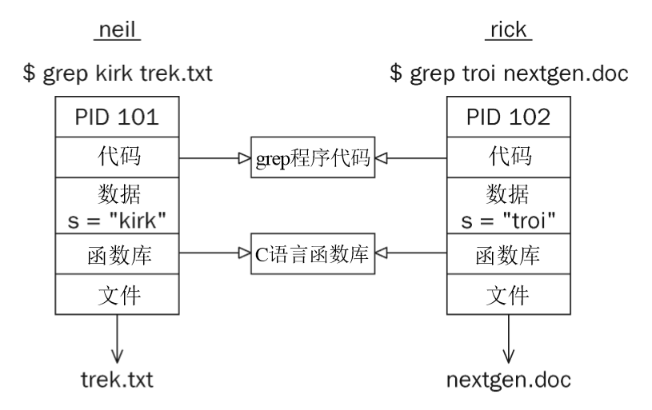

# 第11章 进程和信号

---

## 什么是进程？

UNIX标准把进程定义为：“一个其中运行着一个或多个线程的地址空间和这些线程所需要的系统资源。”

可以把进程看作是正在运行的程序实例。

作为多用户系统，Linux允许许多用户同时访问系统。每个用户可以同时运行许多个程序，甚至运行同一个程序的许多实例。系统本身也运行着一些管理系统资源和控制用户访问的程序。

进程由程序代码、数据、变量（占用着系统内存）、打开的文件（文件描述符）和环境组成。一般来说，Linux系统会在进程之间共享程序代码和系统函数库，所以任何时刻内存中都只有代码的一份副本。

## 进程的结构

如果有两个用户neil和rich，他们同时运行grep程序在不同文件中查找字符串。他们使用的进程如图所示：



使用如下命令可以查看进程信息：

```shell
$ ps -ef
```

每个进程都会被分配一个唯一的数字编号，我们称之为进程标识符或PID。它通常是一个取值范围从2到32768的正整数。当进程被启动时，系统将按顺序选择下一个未被使用的数字作为它的PID。数字1一般是为特殊进程init保留的，init进程负责管理其他进程。

grep命令执行的程序代码保存在一个磁盘文件中，它以只读的方式加载到内存中，可以被多个进程安全地共享。

系统函数库也可以被共享。例如，不管有多少个正在运行的程序要调用printf函数，内存中只要有它的一份副本即可。

进程也有不会被共享的东西：

- 文件描述符可能不会被共享。

- 栈空间，用于保存函数中的局部变量和控制函数的调用与返回。

- 自己的环境空间。

- 进程必须维护自己的程序计数器，它用来记录它执行到的位置。

